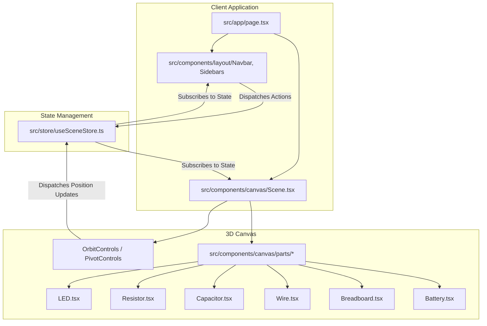

# Nodal — Interactive 3D Circuit Simulator

Nodal is an interactive, browser-based 3D electronics simulator built using **Next.js**, **React Three Fiber (Three.js)**, and **Zustand**. It provides a rich, responsive, and aesthetically premium workspace where users can build, simulate, and configure electronic circuits in three dimensions.

---

## 🚀 Key Features

* **3D Canvas Workspace:** A fully orbital, zoomable, and pannable 3D viewport rendered via Three.js with realistic lighting, shadows, and environmental reflections.
* **Component Library (Drag & Drop):** Place breadboards, batteries, resistors, capacitors, and LEDs onto the canvas using standard HTML5 drag-and-drop events mapped to 3D space.
* **Intelligent Grid Snapping:** Dynamic collision-based coordinate alignment that snaps components to breadboard pin headers when positioned within the board's physical boundaries.
* **3D Procedural Wires:** High-fidelity, curved wire models using Catmull-Rom spline curves. Customize height (arc trajectories), colors, and toggle real-time current animations.
* **Real-time Simulation Engine:** Toggle the simulation clock to power on circuits, activate light emissions (LED animations), and track elapsed time.
* **Complete History Tracking:** State snapshots captured on every destructive action, allowing multi-level Undo & Redo (up to 50 operations).
* **Workspace customization:** Renaming project files, copying iframe embed scripts, forking configurations, and exporting link embeddings.

---

## 🛠️ Tech Stack & Architecture

### Dependency Architecture


### Technology Specification
* **Next.js 16 (App Router):** Leverages server-side rendering for application layout and client-side dynamic imports with loading fallbacks for WebGL rendering components.
* **React Three Fiber (R3F):** A React reconciler for Three.js. Standardizes Three.js object lifecycles into declarative React hooks and properties.
* **@react-three/drei:** Abstraction helpers for Three.js, including OrbitControls (camera rotation/panning), PivotControls (node translation gizmos), Edges (selection outlines), and Html (projecting HTML elements onto 3D positions).
* **Zustand 5:** Global state container utilizing reactive hooks to synchronize component panels with the 3D WebGL renderer without unnecessary parent-to-child re-renders.
* **TailwindCSS v4:** High-performance CSS styling utilizing modern CSS variable overrides (`@theme`) and custom utility styles for UI panels.

---

## 📂 Project Structure

```
nodal-simulator/
├── public/                 # Static asset delivery (part icons, thumbnails)
├── src/
│   ├── app/
│   │   ├── globals.css     # CSS variable tokens, custom toggle, and layout animations
│   │   ├── layout.tsx      # Root HTML shell configuring Geist fonts & meta tags
│   │   └── page.tsx        # App entry point, rendering panels, sidebars, & dynamic Canvas
│   ├── components/
│   │   ├── canvas/
│   │   │   ├── parts/      # 3D geometries and shaders for electronics
│   │   │   │   ├── Battery.tsx     # 9V Battery mesh, labels, and terminals
│   │   │   │   ├── Breadboard.tsx  # Dynamic pin-grid generator and color rails
│   │   │   │   ├── Capacitor.tsx   # Capacitor body, legs, and polarity indicator
│   │   │   │   ├── LED.tsx         # Led dome, legs, point-light source, and emissive lerp
│   │   │   │   ├── Resistor.tsx    # Resistor cylinder, color band segments, and values
│   │   │   │   └── Wire.tsx        # Catmull-Rom spline curves extruded into tubes
│   │   │   └── Scene.tsx   # Canvas entry, light sources, environment, and drag/drop
│   │   ├── layout/         # Structural user interface panels
│   │   │   ├── LeftSidebar.tsx  # Part catalog sidebar (implemented/unimplemented states)
│   │   │   ├── Navbar.tsx       # Undo/Redo operations, simulation triggers, and project renaming
│   │   │   └── RightSidebar.tsx # Property inspection panel, rotation, and display settings
│   │   └── ui/             # Reusable UI controls
│   │       └── Toggle.tsx  # Smooth custom sliding toggle switch
│   └── store/
│       └── useSceneStore.ts # Central Zustand state store (nodes, wires, actions, undo/redo stacks)
├── package.json            # Scripts, dependencies, and configuration settings
└── tsconfig.json           # Strict TypeScript configuration
```

---

## ⚙️ Core Modules & Logic

### 1. State Management & Operations (`useSceneStore.ts`)
The simulator utilizes a Zustand store to handle its entire data lifecycle.

```typescript
export interface SceneNode {
  id: string;
  type: PartType;
  position: [number, number, number];
  rotation: [number, number, number];
  properties: Record<string, unknown>;
}

export interface WireConnection {
  id: string;
  sourceNodeId: string;
  sourcePin: string;
  targetNodeId: string;
  targetPin: string;
  color: string;
  height: 'Low' | 'Medium' | 'High';
  showCurrent: boolean;
}
```

#### Node Positioning & Grid Snapping
When dragging a component on the canvas, its 3D coordinate vector $(n_x, n_y, n_z)$ is updated. If a breadboard exists, the store calculates the distance between the node and the breadboard's center $(b_x, b_y, b_z)$. 

If the node falls within the boundaries of the board ($\Delta_x < 7$ and $\Delta_z < 2.1$), it snaps to the nearest pin hole spaced at `0.35` coordinate intervals:
$$\text{snapX} = \text{round}\left(\frac{n_x - b_x}{0.35}\right) \times 0.35 + b_x$$
$$\text{snapZ} = \text{round}\left(\frac{n_z - b_z}{0.35}\right) \times 0.35 + b_z$$

#### State History Snapshots (Undo & Redo)
To achieve clean state rollbacks:
1. Prior to executing any state modification (adding nodes, deleting parts, or updating node parameters), `pushHistory()` is called.
2. The current state is deep-cloned via `JSON.parse(JSON.stringify(nodes/wires))` and appended to the `undoStack` (capped at $50$ entries to preserve memory).
3. The `redoStack` is cleared on new actions to ensure linear history.
4. Calling `undo()` moves the top of the `undoStack` back into `nodes`/`wires` and shifts the current configuration to the `redoStack`.

---

### 2. 3D Parts & Physics Geometries (`src/components/canvas/parts/`)

Each component is procedurally modeled or assembled using default primitive geometries (`cylinderGeometry`, `boxGeometry`, `sphereGeometry`) to achieve an appealing, clean mechanical look:

#### 💡 LED (Light Emitting Diode)
* **Model Structure:** A cylinder base and an overlapping sphere dome with `MeshStandardMaterial` settings (`transparent: true, opacity: 0.7`).
* **Visual Glow Logic:** Under simulation (`isSimulating === true`), a frame loop utilizes R3F's `useFrame` to lerp the dome material's `emissiveIntensity` from `0` to a target of `3.0` using:
  ```typescript
  const lerped = THREE.MathUtils.lerp(currentIntensity, targetIntensity, deltaTime * 5);
  ```
  A child `<pointLight>` is activated concurrently with matching intensity settings to cast a real color-wash over nearby geometries on the breadboard.

#### ⚡ Resistor
* **Model Structure:** A ceramic body (`cylinderGeometry` with `#deb887`) featuring four offset band meshes mapping the resistance value.
* **Code Implementation:** A map renders color-coded rings procedurally at set horizontal shifts (`[-0.3, -0.15, 0, 0.25]`) to represent nominal values.

#### 🪛 Wire
* **Bezier Curve Math:** Connections use the two 3D endpoint coordinates $(S, E)$ to calculate a midpoint vector $M$ offset by the wire's selected path height (Low = 2, Medium = 4, High = 6):
  $$M_y = \text{lerp}(S, E, 0.5)_y + \text{arcHeight}$$
* **Control Points:** Control vectors $CP_1$ and $CP_2$ are placed at $20\%$ and $80\%$ steps along the path, respectively, to create a shallow, smooth takeoff and landing angle:
  $$CP_{1y} = S_y + \text{arcHeight} \times 0.4$$
  $$CP_{2y} = E_y + \text{arcHeight} \times 0.4$$
* **Spline Interpolation:** A `CatmullRomCurve3` interpolates a path along `[S, CP1, M, CP2, E]`, which is then fed into a `TubeGeometry` with a radial width of `0.05` to render a realistic, physical wire tube.

---

### 3. Layout Control Panels (`src/components/layout/`)

The viewport is surrounded by three layout panels:

* **Navbar (Top):**
  * Displays project title and features inline double-click editing.
  * Shows simulation clock ticking in real-time when active.
  * Contains buttons for history undo/redo (binds shortcuts: `Cmd/Ctrl + Z` for undo, `Cmd/Ctrl + Shift + Z` for redo).
  * Hosts the `EmbedPopover` for copying iframe codes and URLs.
* **LeftSidebar (Insert Catalog):**
  * Displays a catalog of electronic elements.
  * Dragging an element uses HTML5's drag-and-drop APIs (`onDragStart`, mapping `application/nodal-part` type data).
  * Dropping components onto the Canvas fires `onDrop` event listeners, executing coordinate mapping:
    ```typescript
    const spawnPos = [
      (clientX / window.innerWidth - 0.5) * 20,
      type === 'Breadboard' ? 0.25 : 1,
      (clientY / window.innerHeight - 0.5) * 20
    ];
    ```
* **RightSidebar (Properties Panel):**
  * Exposes custom controls matching the selected component's specifications (e.g., editing battery voltage, choosing LED colors, adjusting resistor resistance, configuring wire heights).
  * Displays display toggle switches (labels & voltage highlights) and orbital camera adjustment buttons.

---

## 🛠️ Installation & Getting Started

### 📋 Prerequisites
Ensure you have **Node.js** (v18.x or later) and **npm** installed on your workstation.

### 💻 Local Run
1. Clone this repository to your local computer.
2. Install dependencies:
   ```bash
   npm install
   ```
3. Run the development server:
   ```bash
   npm run dev
   ```
4. Open [http://localhost:3000](http://localhost:3000) inside your web browser to access the editor.

### 🚀 Production Compilation
To compile and execute a production build:
```bash
npm run build
npm run start
```

---

## 🗺️ Component Registry & Status

| Part Name | Type Code | Current MVP Status | Configurable Properties |
| :--- | :--- | :--- | :--- |
| **Breadboard** | `Breadboard` | ✅ Fully Implemented | *Spatial coordinates* |
| **Battery** | `Battery` | ✅ Fully Implemented | Voltage ($V$) |
| **LED** | `Led` | ✅ Fully Implemented | Color (Red, Blue, Green, Yellow, White) |
| **Resistor** | `Resistor` | ✅ Fully Implemented | Resistance ($\Omega$) |
| **Capacitor** | `Capacitor` | ✅ Fully Implemented | Capacitance ($\mu\text{F}$) |
| **Wire** | `Wire` | ✅ Fully Implemented | Color (Red, Black, Blue, Green), Height, Current |
| **Tactile Switch** | `Tactile Switch` | 🚧 Mocked (Catalog List) | State (Open/Closed) |
| **Fuse** | `Fuse` | 🚧 Mocked (Catalog List) | Current Limit ($A$) |
| **Arduino Uno** | `Battery` (Alias) | 🚧 Mocked (Catalog List) | Embedded Code input |
| **Motor** | `Motor` | 🚧 Mocked (Catalog List) | Input Voltage |
| **Transistor (NPN/PNP)**| `NPN Transistor` / `PNP Transistor` | 🚧 Mocked (Catalog List) | Gain ($h_{FE}$) |
